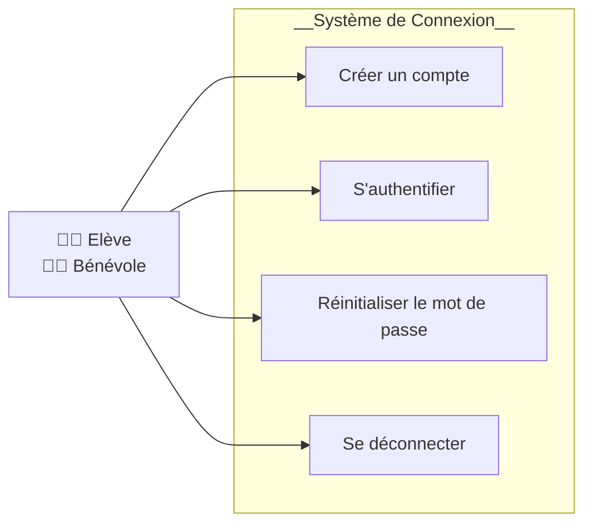
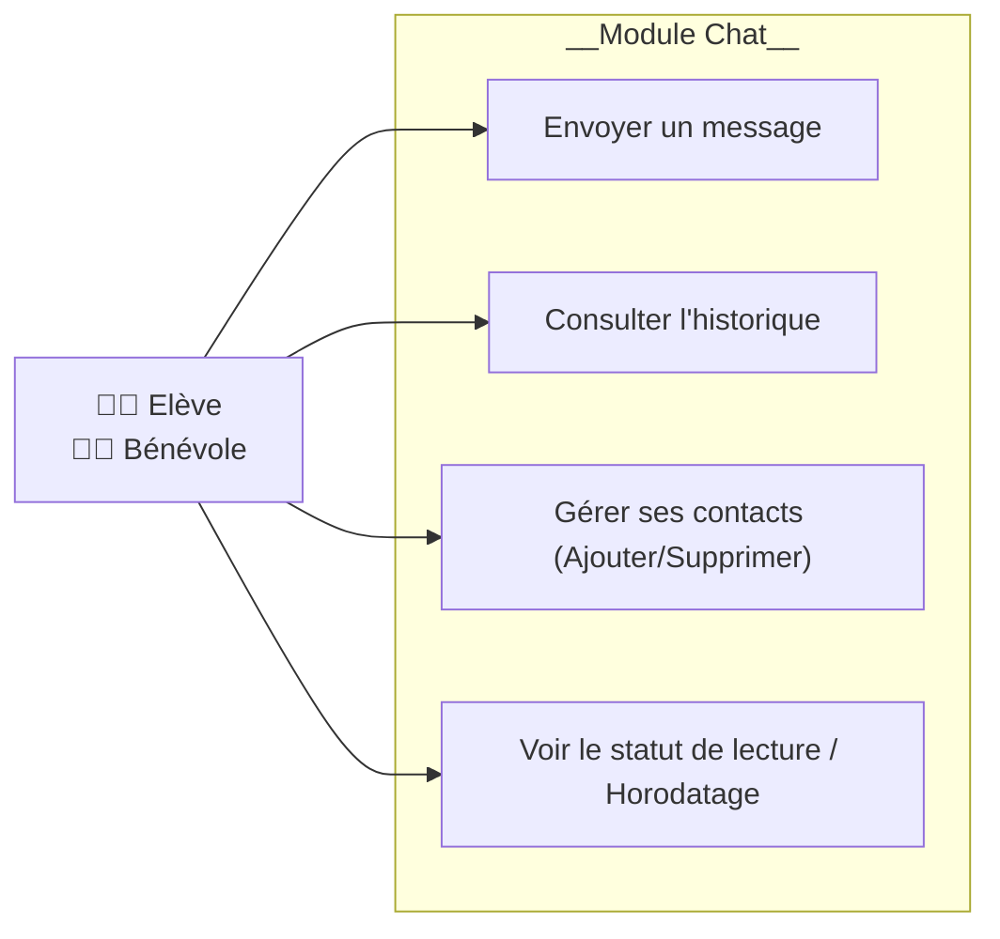
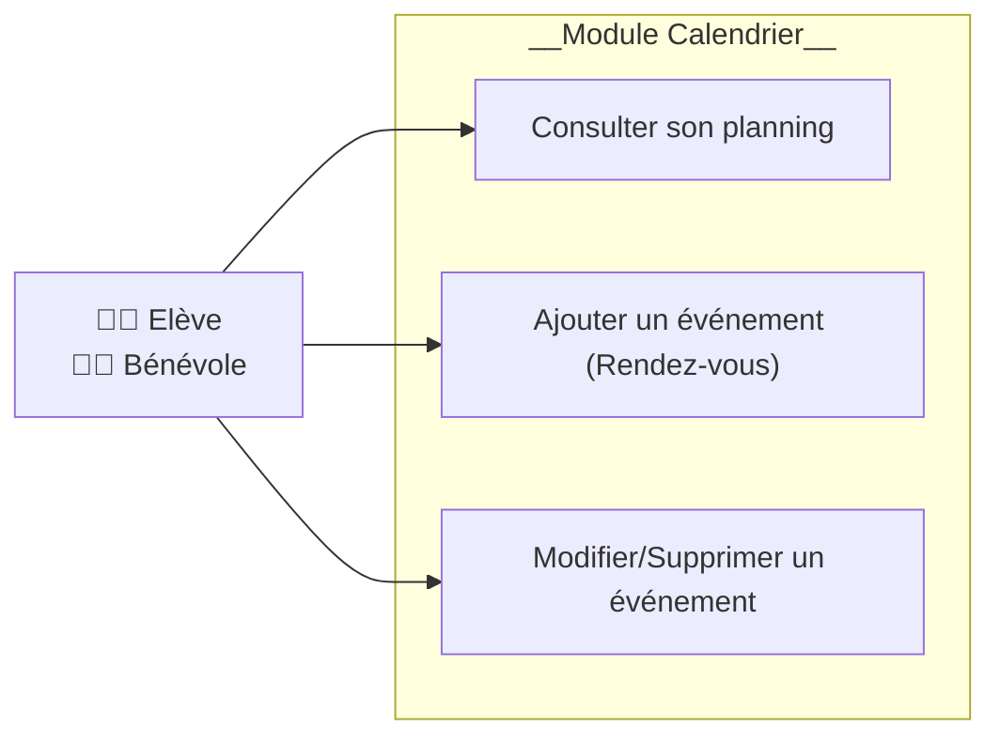
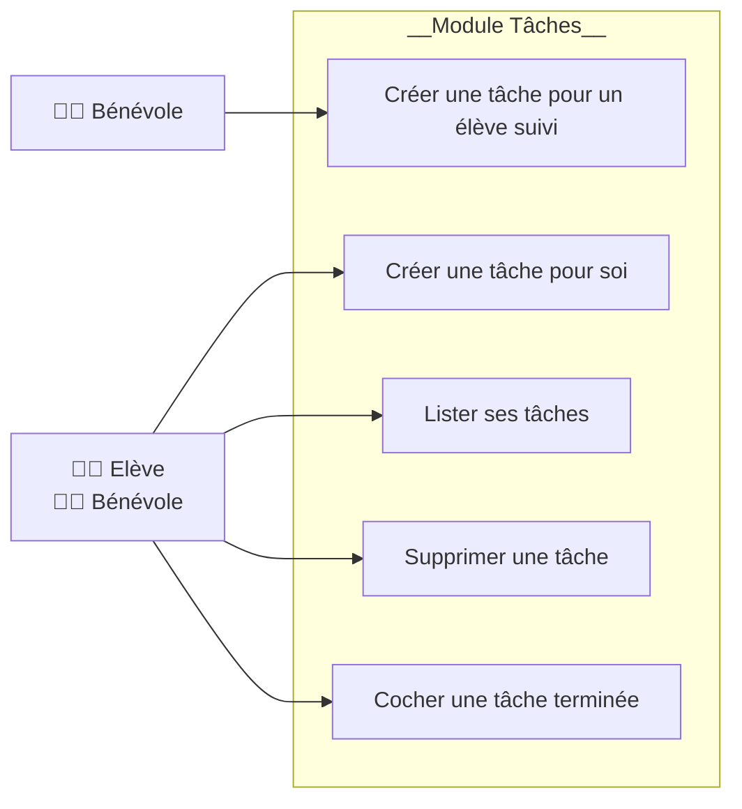
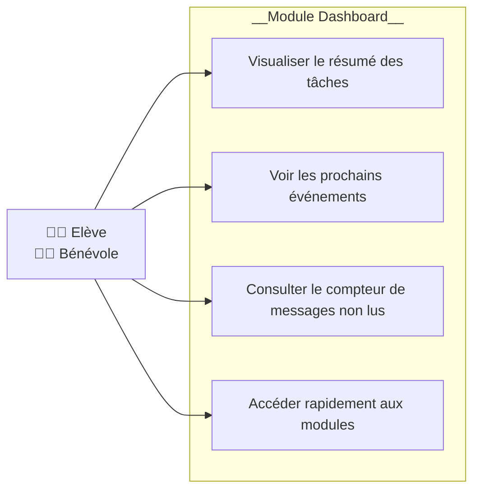

# Diagrammes de cas d'usage - Learn@Home

Ce document présente les interactions entre les utilisateurs (Elèves et Bénévoles) et le système pour chaque fonctionnalité majeure, détaillant les responsabilités de chaque acteur.

\* N.B : _Bien que techniquement incorrect, lorsque cela est possible, les acteurs "Elève" et "Bénévole" sont fusionnés afin de réduire le nombre de flèches et donc de faciliter la lecture._

---

## 1. Connexion (Login)

**Description du cas d'usage :**

- **Acteurs :** Elève, Bénévole.
- **Préconditions :** L'utilisateur doit avoir accès à Internet et à l'URL de l'application.
- **Scénario Nominal :**
    1. L'utilisateur saisit ses identifiants.
    2. Le système vérifie les informations.
    3. L'utilisateur est redirigé vers le tableau de bord.
- **Post-conditions :** L'utilisateur est authentifié et sa session est active.

---

## 2. Chat (Discussion instantanée)

**Description du cas d'usage :**

- **Acteurs :** Elève, Bénévole.
- **Préconditions :** L'utilisateur doit être connecté.
- **Scénario Nominal :**
    1. L'utilisateur sélectionne un contact.
    2. L'historique des messages s'affiche.
    3. L'utilisateur saisit et envoie un message.
    4. Le destinataire reçoit une notification en temps réel.
- **Post-conditions :** Le message est enregistré en base de données et marqué comme "envoyé".

---

## 3. Calendrier (Gestion des rendez-vous)

**Description du cas d'usage :**

- **Acteurs :** Elève, Bénévole.
- **Scénario Nominal :**
    1. L'utilisateur ouvre la page calendrier.
    2. Il sélectionne un créneau pour ajouter un cours de soutien scolaire.
    3. Le système enregistre l'événement et met à jour la vue pour les deux participants.
- **Post-conditions :** Le rendez-vous est visible sur le calendrier et le tableau de bord.

---

## 4. Gestionnaire de tâches (To-do List)

**Description du cas d'usage :**

- **Acteurs :** Elève (Restriction sur UC13), Bénévole.
- **Scénario Nominal (Bénévole vers Elève) :**
    1. Le bénévole crée une tâche (ex: "Réviser les fractions").
    2. Il l'assigne à son élève.
    3. L'élève voit la tâche apparaître dans sa liste.
- **Post-conditions :** La tâche est persistée avec l'ID de l'auteur et du destinataire.

---

## 5. Tableau de bord (Dashboard)

**Description du cas d'usage :**

- **Acteurs :** Elève, Bénévole.
- **Scénario Nominal :**
    1. Dès la connexion, l'utilisateur accède à une vue synthétique.
    2. Les données sont agrégées depuis les autres modules (Chat, Calendrier, Tâches).
- **Post-conditions :** L'utilisateur a une vision globale de ses priorités sans changer de page.

---
